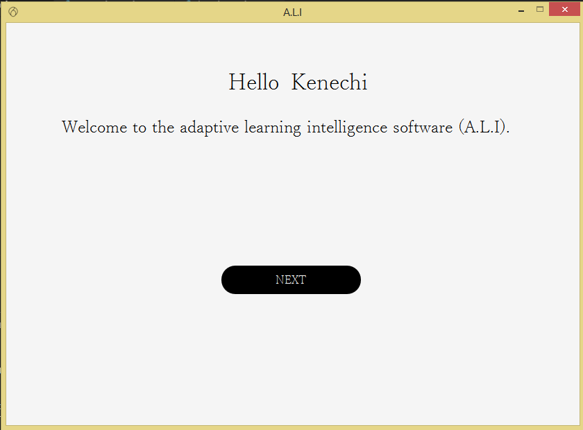
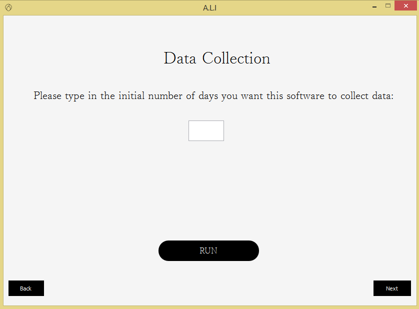
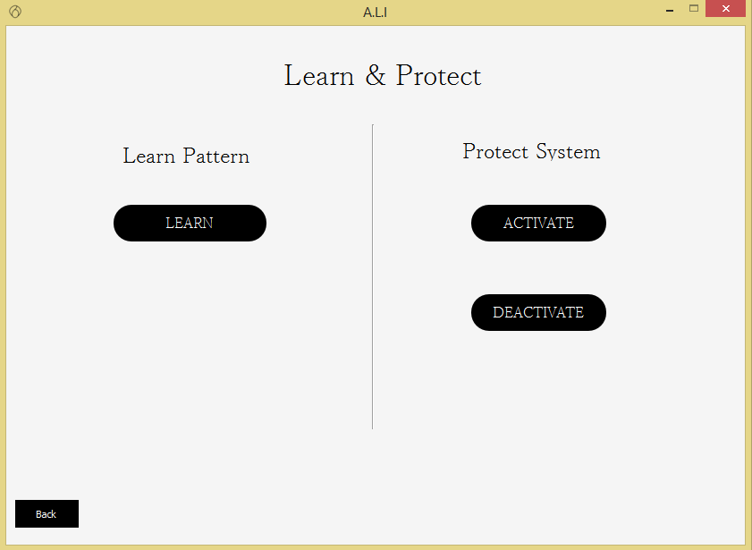

# ALI

### Adaptive Learning Intelligence (A.L.I):

Adaptive Learning Intelligence( A. L. I) is a security software that works as a continous user authenticator. It works as the second phase for laptop/desktop authentication, the 
first been the passcode authentication phase. A.L.I authenticates users based on soft biometrics (behaviourial metrics) such as keystroke dynamics, mouse dynamics, and desktop -
application use. The learning algorithms (AutoEncoder(s)) are trained on the data generated and put together to detect anomalies when users are interacting with the device.

### Simple User Interface
##### Welcome Screen

##### Collection Screen

##### Train&Protect Screen

### Requirements to Run Desktop Application:
1) Use a system running on Windows.
2) To run the application make sure to have the python 3.6.x version.

### How to run application:
1) Clone the repository
2) On the local repository create and activate a virtual enviroment
3) Install the required libraries from the requirements.txt   --> pip install -r requirements.txt 
4) On the cli run: python main.py

### Future Plan:
More updates will be made in other to fix current issues and optimize application flow.

